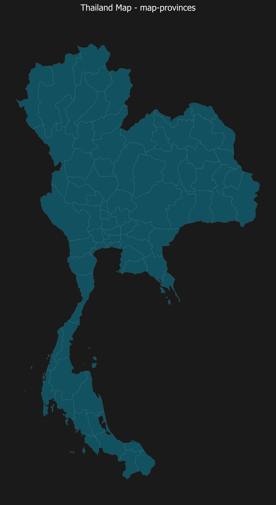
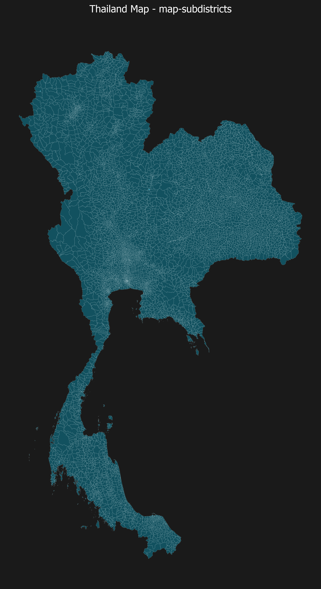
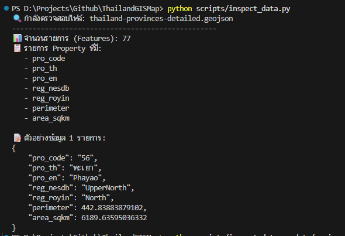
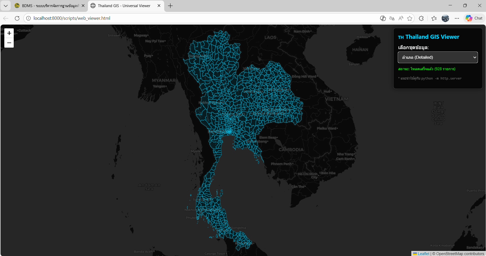
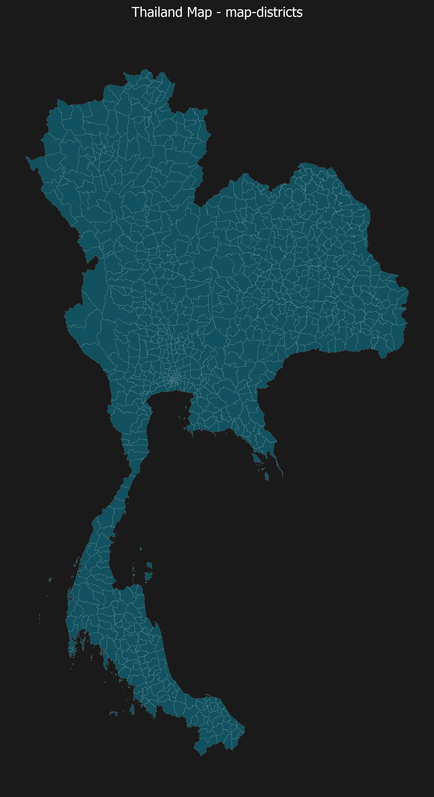

# Thailand Universal GIS Data Stack (v1.3.0)

A comprehensive project for aggregating and categorizing Thailand's Geographic Information System (GIS) data from internationally recognized sources and official government agencies. The objective is to support the development of high-precision information systems at the provincial, district, and subdistrict levels.

> **Note:** Large data files (e.g., `subdistricts-final.json` 2.3GB) cannot be stored in the GitHub Repository. Download from:
>
> 📁 **[Google Drive - Thailand GIS Data](https://drive.google.com/drive/folders/19qzSeh0KupOzX0P-T29NqYLZh--SNgbC)**

---

## Data Structure (Data Categories)

The dataset is classified into three primary formats to cover all major industry-standard use cases:

### 1. High-Performance Optimized (Recommended)

Datasets processed through a "data slimming" pipeline (77% size reduction) to ensure practical web application usage without sacrificing coordinate accuracy.

* `data/geojson/web-optimized/thailand-subdistricts-optimized.json`
  Subdistrict level (339 MB - recommended for subdistrict-level applications)

* `data/geojson/web-optimized/thailand-provinces-web.json`
  Provincial level



---

### 2. Official Grade (Standard & Precise)

**Data Source:** UN OCHA (Humanitarian Data Exchange - HDX)
High-precision administrative boundary data based on international P-Code standards, including centroid coordinates.

* `data/geojson/final/provinces-final.json`
  Provincial level (77 provinces)

* `data/geojson/final/districts-final.json`
  District level (928 districts)

* `data/geojson/final/subdistricts-final.json`
  Subdistrict level (2.3 GB)



---

### 3. Professional Shapefiles (Standard GIS)

**Reference Source:** cvibhagool/thailand-map
Industry-standard Shapefile datasets designed for professional use with GIS engineering software (e.g., QGIS, ArcGIS).

* `data/shapefile/`
  (Includes .shp, .dbf, .shx, .prj files)

---

## Use Case Selection Table

| Use Case | Recommended Dataset | Rationale |
| :--- | :--- | :--- |
| Web Application / Dashboard Development | Web Optimized | Smaller file size, faster loading |
| Statistical Analysis / Research | Official Grade | High coordinate accuracy, international standard |
| Cartography / QGIS Design | Professional Shapefiles | Compatible with standard GIS tools |
| Address & Geographic Code Search | Official Grade | Complete P-Code and centroid data |

---

## Automated Data Pipeline

This project includes an automated data management pipeline implemented with Python scripts to ensure data freshness and structural consistency.

### 1. Data Synchronization (`update_gis_pipeline.py`)

Fetches the latest dataset directly from the UN OCHA API and automatically organizes the file structure.

```powershell
python scripts/update_gis_pipeline.py
```

---

### 2. Dataset Standardization (`finalize_dataset.py`)

Processes raw international source data into the project's standardized structure (Standardized Property Mapping).

```powershell
python scripts/finalize_dataset.py
```

---

### 3. Optimization (`optimize_geojson.py`)

Advanced processing to reduce GeoJSON file size (up to 77%) by adjusting coordinate precision and applying minification.

```powershell
python scripts/optimize_geojson.py
```

---

## Utilities

### Data Inspection Tool (`inspect_data.py`)

Used to inspect GeoJSON metadata structure and feature properties.



```powershell
python scripts/inspect_data.py [path_to_file]
```

---

### Interactive Map Viewer (`web_viewer.html`)

A browser-based GIS preview system built with Leaflet.js.



1. Start a local server: `python -m http.server 8000`
2. Access via: `http://localhost:8000/scripts/web_viewer.html`

---

### Map Export System (`export_to_image.py`)

A utility for exporting GeoJSON data into high-resolution PNG images (300 DPI) for presentations and reporting.



```powershell
python scripts/export_to_image.py
```

---

## SQL Server Integration

This project integrates seamlessly with [ThailandLocation77DatabaseSQLServer](https://github.com/JonusNattapong/ThailandLocation77DatabaseSQLServer) to allow direct interoperability with existing SQL Server-based systems.

---

### 1. Zipcode Enrichment

Postal codes (`POSTCODE`) from the `amphur` table in SQL Server are merged into the GeoJSON dataset, enabling district and subdistrict levels to include postal code information.

* Script: `scripts/merge_zipcodes.py`

---

### 2. GIS Bridge to SQL Server

A script is provided to automatically generate SQL Update statements that add `LATITUDE`, `LONGITUDE`, and `AREA_SQKM` columns into your SQL Server database.

```powershell
python scripts/generate_sql_bridge.py
```

* Output: `data/thailand_gis_update.sql` (Executable directly in SSMS)

---

## Property Cheat Sheet

| Key | Description | Example |
| :--- | :--- | :--- |
| `pro_th` / `pro_en` | Province name (Thai / English) | พะเยา / Phayao |
| `amp_th` / `amp_en` | District name (Thai / English) | สิงหนคร / Singhanakhon |
| `tam_th` / `tam_en` | Subdistrict name (Thai / English) | พระบรมมหาราชวัง |
| `pro_code` | Administrative P-Code | TH10 |
| `area_sqkm` | Area coverage (sq km) | 1571.37 |
| `center_lat` / `center_lon` | Centroid coordinates | 13.72 / 100.60 |

---

## Credits

Special thanks to the following organizations and contributors for providing open data resources for public benefit:

1. **UN OCHA / HDX**
   [https://data.humdata.org/dataset/cod-ab-tha](https://data.humdata.org/dataset/cod-ab-tha)

2. **chingchai/OpenGISData-Thailand**
   [https://github.com/chingchai/OpenGISData-Thailand](https://github.com/chingchai/OpenGISData-Thailand)

3. **apisit/thailand.json**
   [https://github.com/apisit/thailand.json](https://github.com/apisit/thailand.json)

4. **cvibhagool/thailand-map**
   [https://github.com/cvibhagool/thailand-map](https://github.com/cvibhagool/thailand-map)

---

## Project Maintainer

**Nattapong Tapachoom**
Email: [jonusnattapong@gmail.com](mailto:jonusnattapong@gmail.com)
GitHub Profile: [https://github.com/JonusNattapong](https://github.com/JonusNattapong)

---

*Designed and maintained to support Thailand's geospatial information community.*
