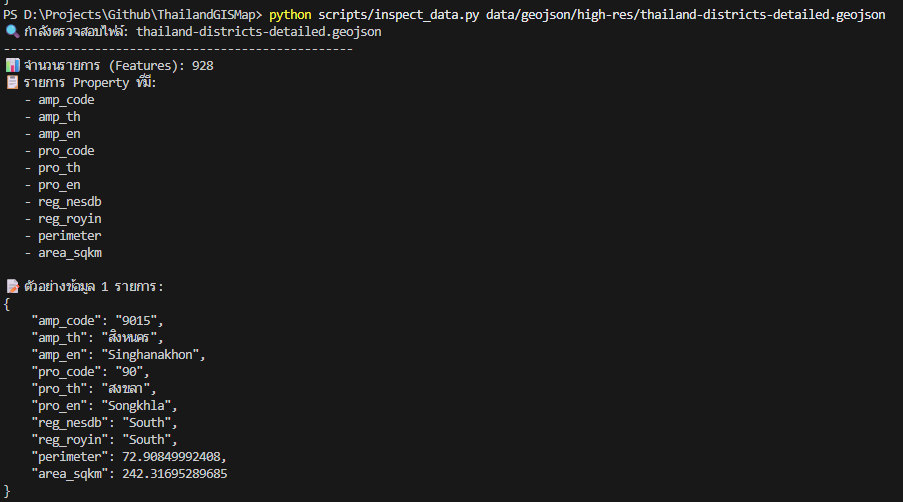

# Thailand Universal GIS Data Stack Documentation

เอกสารประกอบชุดข้อมูลภูมิสารสนเทศ (GIS) ประเทศไทย ที่รวบรวมจากแหล่งข้อมูลมาตรฐาน 3 แหล่ง เพื่อจัดหมวดหมู่ให้เหมาะสมกับการใช้งานในรูปแบบต่างๆ

## โครงสร้างและการจัดหมวดหมู่ข้อมูล

ชุดข้อมูลถูกแบ่งออกเป็น 3 รูปแบบหลักตามวัตถุประสงค์การใช้งาน ดังนี้:

### 1. Web Optimized Data (แหล่งที่มา: apisit/thailand.json)

ชุดข้อมูล GeoJSON ที่ผ่านการลดทอนรายละเอียดเพื่อความรวดเร็วในการแสดงผลบนเว็บแอปพลิเคชันและแดชบอร์ด

* `data/geojson/web-optimized/thailand-provinces-web.json`: ข้อมูลขอบเขตจังหวัดขนาดเล็ก พร้อมชื่อภาษาอังกฤษ
* `data/geojson/web-optimized/thailand-provinces-density.json`: ข้อมูลจังหวัดพร้อมสถิติความหนาแน่นประชากร

### 2. High Resolution GeoJSON (แหล่งที่มา: chingchai/OpenGISData-Thailand)

ชุดข้อมูลที่มีความละเอียดสูง เหมาะสำหรับการวิเคราะห์เชิงสถิติหรืองานวิจัยที่ต้องการความแม่นยำของขอบเขตการปกครอง

* `data/geojson/high-res/thailand-provinces-detailed.geojson`: ระดับจังหวัด (77 จังหวัด)
* `data/geojson/high-res/thailand-districts-detailed.geojson`: ระดับอำเภอ (928 อำเภอ)
* `data/geojson/high-res/thailand-subdistricts-detailed.geojson`: ระดับตำบล (7,367 ตำบล)

### 3. Professional GIS Formats (แหล่งที่มา: cvibhagool/thailand-map)

ชุดข้อมูลมาตรฐานสำหรับใช้งานร่วมกับซอฟต์แวร์ทางด้าน GIS เช่น QGIS หรือ ArcGIS

* `data/shapefile/`: ประกอบด้วยไฟล์ .shp, .dbf, .shx และ .prj ซึ่งเป็นมาตรฐานสากล

---

## เครื่องมือและสคริปต์ประกอบการใช้งาน

ภายในโครงการได้จัดเตรียมสคริปต์ในโฟลเดอร์ `/scripts` เพื่ออำนวยความสะดวกในการบริหารจัดการข้อมูล:

### 1. ระบบตรวจสอบคุณสมบัติข้อมูล (inspect_data.py)

สคริปต์สำหรับตรวจสอบจำนวนรายการ (Features) และรายชื่อคุณสมบัติ (Properties) ภายในไฟล์ GeoJSON


คำสั่งสำหรับการใช้งาน:

```powershell
# ตรวจสอบข้อมูลระดับจังหวัด (ค่าเริ่มต้น)
python scripts/inspect_data.py

# ตรวจสอบข้อมูลระดับพื้นที่อื่นๆ
python scripts/inspect_data.py [path_to_geojson_file]
```

### 2. ระบบแสดงผลแผนที่เชิงโต้ตอบ (web_viewer.html)

หน้าเว็บสำหรับพรีวิวข้อมูลแผนที่ผ่านเบราว์เซอร์ โดยใช้ไลบรารี Leaflet.js ซึ่งรองรับการสลับชุดข้อมูลและแสดงรายละเอียดเมื่อนำเมาส์ไปชี้ในแต่ละพื้นที่


ขั้นตอนการเข้าใช้งาน:

1. เปิด Terminal ใน Root Directory ของโครงการ
2. เริ่มการทำงานของ Local Server: `python -m http.server 8000`
3. เข้าชมผ่านเว็บเบราว์เซอร์ที่ URL: [http://localhost:8000/scripts/web_viewer.html](http://localhost:8000/scripts/web_viewer.html)

---

## ตัวอย่างโครงสร้างข้อมูลภายใน

### รายละเอียดข้อมูลระดับจังหวัด


```json
{
    "pro_code": "56",
    "pro_th": "พะเยา",
    "pro_en": "Phayao",
    "area_sqkm": 6189.63
}
```

### รายละเอียดข้อมูลระดับอำเภอ



```json
{
    "amp_code": "9015",
    "amp_th": "สิงหนคร",
    "amp_en": "Singhanakhon",
    "pro_th": "สงขลา",
    "area_sqkm": 242.31
}
```

---

## ตารางอ้างอิงคุณสมบัติข้อมูล (Property Mapping)

คุณสมบัติที่สำคัญภายในชุดข้อมูล GeoJSON สำหรับการเขียนโปรแกรมมีดังนี้:

* `tam_th / tam_en`: ชื่อตำบล (ภาษาไทย / ภาษาอังกฤษ)
* `amp_th / amp_en`: ชื่ออำเภอ (ภาษาไทย / ภาษาอังกฤษ)
* `pro_th / pro_en`: ชื่อจังหวัด (ภาษาไทย / ภาษาอังกฤษ)
* `reg_nesdb / reg_royin`: ภูมิภาคตามมาตรฐานของสภาพัฒน์ และราชบัณฑิตยสภา
* `area_sqkm`: พื้นที่หน่วยตารางกิโลเมตร

---

## แหล่งข้อมูลอ้างอิง

โครงการนี้ขอขอบคุณผู้จัดทำชุดข้อมูลต้นทาง ดังนี้:

1. **chingchai**/OpenGISData-Thailand (สำหรับการปกครองระดับตำบล)
2. **apisit**/thailand.json (สำหรับชุดข้อมูลเว็บแอปพลิเคชัน)
3. **cvibhagool**/thailand-map (สำหรับชุดข้อมูล Shapefile มาตรฐาน)

---

## ผู้จัดทำ

**Nattapong Tapachoom**
📧 Email: <jonusnattapong@gmail.com>
🔗 ติดต่อผ่านทาง GitHub Profile
