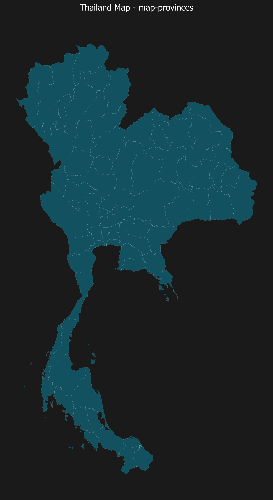
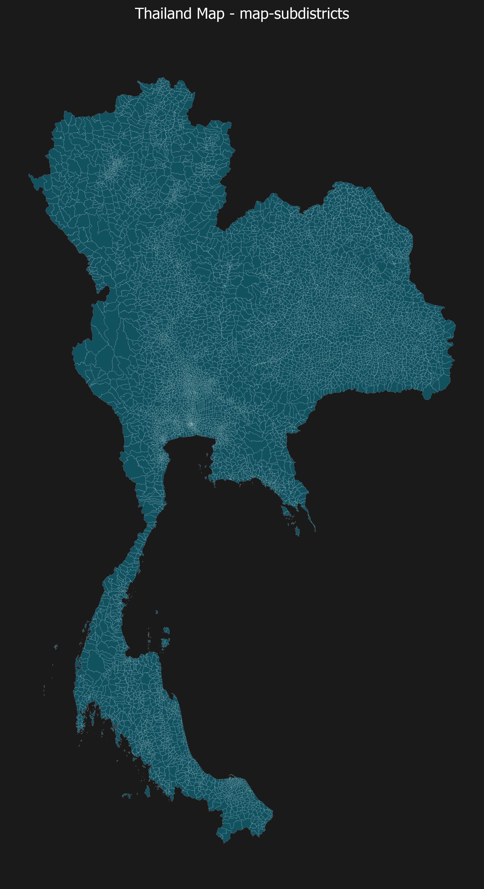
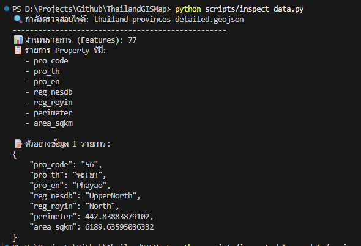
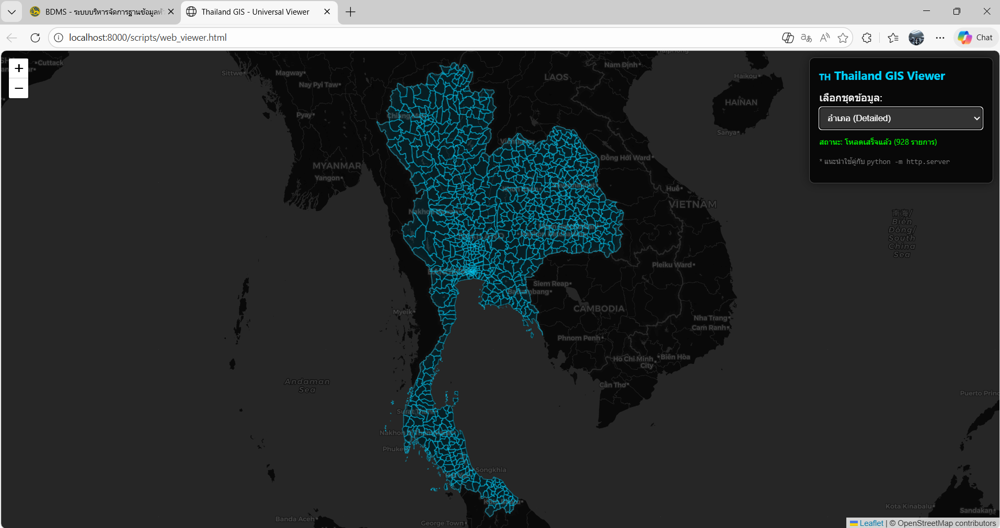
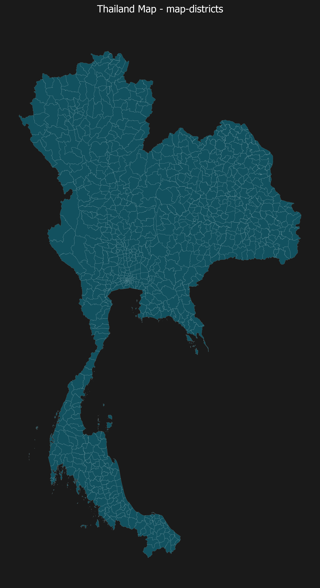
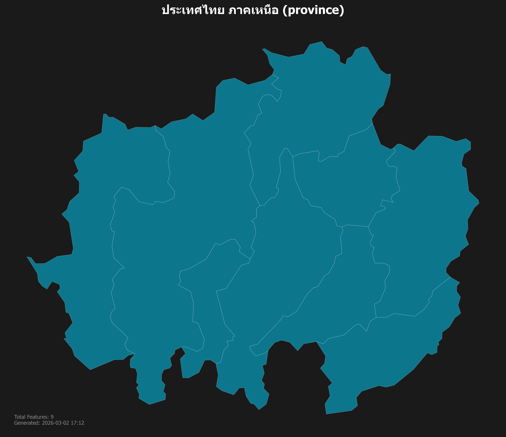
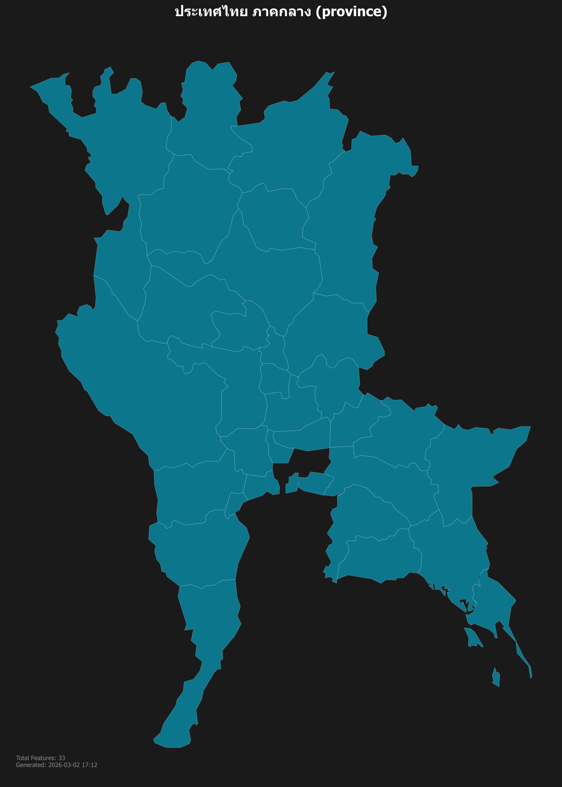
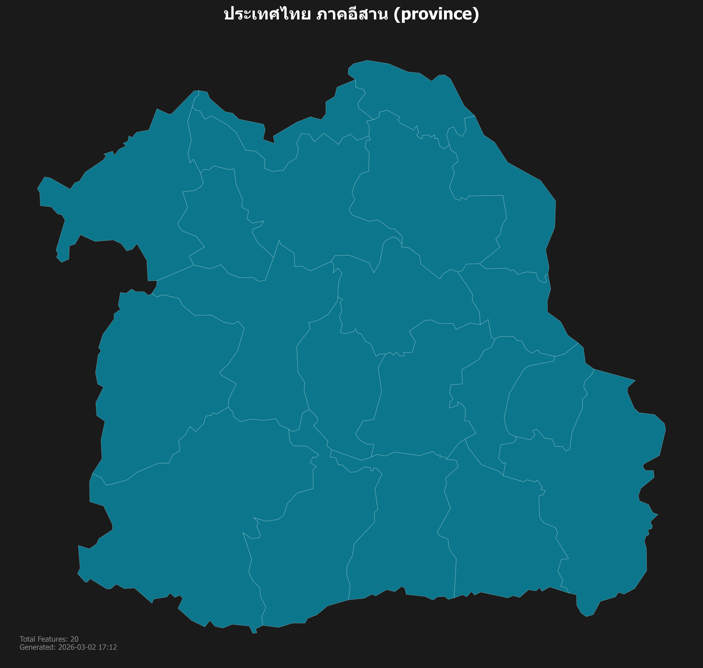
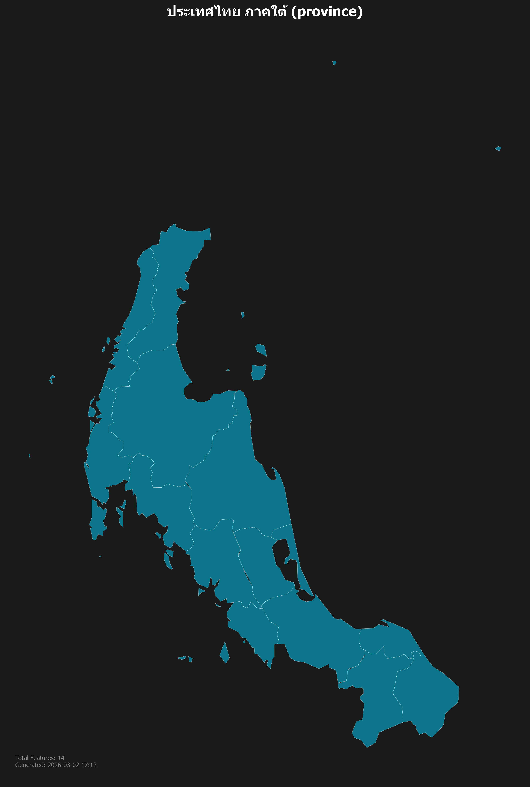

# Thailand Universal GIS Data Stack (v1.4.0)

โครงการรวบรวมและจัดหมวดหมู่ข้อมูลภูมิสารสนเทศ (GIS) ของประเทศไทยจากแหล่งข้อมูลมาตรฐานสากลและหน่วยงานภาครัฐ เพื่อสนับสนุนการพัฒนาระบบเทคโนโลยีสารสนเทศที่ต้องการความแม่นยำสูงในระดับจังหวัด, อำเภอ และตำบล

> **หมายเหตุ:** ไฟล์ข้อมูลขนาดใหญ่ (เช่น `subdistricts-final.json` 2.3GB) ไม่สามารถเก็บใน GitHub Repository ได้ สามารถดาวน์โหลดได้จาก:
>
> 📁 **[Google Drive - Thailand GIS Data](https://drive.google.com/drive/folders/19qzSeh0KupOzX0P-T29NqYLZh--SNgbC)**

---

## 🆕 Version 1.4.0 - Latest Updates

### New Features

- **🗺️ Regional Support**: รองรับการกรองและแสดงผลแยกตามภูมิภาค (เหนือ/กลาง/อีสาน/ใต้)
- **🗂️ Advanced Filtering**: กรองข้อมูลระดับจังหวัดและภูมิภาคได้ใน Web Viewer และสคริปต์ Export
- **📸 High-Res Regional Export**: ส่งออกแผนที่แยกตามภูมิภาคความละเอียดสูงอัตโนมัติ
- **🎯 Smart Info Box**: แสดงข้อมูลละเอียด (ชื่อไทย-Eng, อำเภอ, จังหวัด, รหัสไปรษณีย์) ในตัวพรีวิว
- **📱 Responsive Design**: รองรับการแสดงผลบนอุปกรณ์ต่างๆ

### Improvements

- เพิ่มตัวเลือกข้อมูลตำบล Web Optimized ใน Web Viewer
- ตั้งชื่อไฟล์อัตโนมัติตามข้อมูลและจังหวัดที่เลือก
- ปรับปรุงประสิทธิภาพการโหลดข้อมูล

---

## โครงสร้างข้อมูล (Data Categories)

ชุดข้อมูลถูกจำแนกออกเป็น 3 รูปแบบหลัก เพื่อให้ครอบคลุมทุกวัตถุประสงค์การใช้งานในระดับมาตรฐานอุตสาหกรรม:

### 1. High-Performance Optimized (Highly Recommended)

ชุดข้อมูลที่ผ่านกระบวนการ "Optimized" (77% Reduction) เพื่อให้สามารถใช้งานบนเว็บแอปพลิเคชันได้จริงโดยไม่สูญเสียความแม่นยำทางพิกัด

- `data/geojson/web-optimized/thailand-subdistricts-optimized.json`: ระดับตำบล (339 MB - แนะนำสำหรับระดับตำบล)
- `data/geojson/web-optimized/thailand-provinces-web.json`: ระดับจังหวัด



### 2. Official Grade (Standard & Precise)

**แหล่งข้อมูลอ้างอิง:** UN OCHA (Humanitarian Data Exchange - HDX)
ข้อมูลขอบเขตการปกครองที่มีความแม่นยำสูงสุด อ้างอิงมาตรฐานรหัส P-Code สากล พร้อมข้อมูลพิกัดจุดศูนย์กลาง (Centroids)

- `data/geojson/final/provinces-final.json`: ระดับจังหวัด (77 จังหวัด)
- `data/geojson/final/districts-final.json`: ระดับอำเภอ (928 อำเภอ)
- `data/geojson/final/subdistricts-final.json`: ระดับตำบล (2.3 GB)



### 3. Professional Shapefiles (Standard GIS)

**แหล่งข้อมูลอ้างอิง:** cvibhagool/thailand-map
ชุดข้อมูลมาตรฐานในรูปแบบ Shapefile สำหรับการใช้งานระดับมืออาชีพร่วมกับซอฟต์แวร์วิศวกรรมแผนที่ (อาทิ QGIS, ArcGIS)

- `data/shapefile/` (ประกอบด้วยไฟล์นามสกุล .shp, .dbf, .shx, .prj)

### ตารางแนะนำการใช้งาน (Use Case Selection)

| ลักษณะงาน | ชุดข้อมูลที่แนะนำ | เหตุผลประกอบ |
| :--- | :--- | :--- |
| พัฒนา Web Application / Dashboard | Web Optimized | ขนาดไฟล์เล็ก โหลดข้อมูลได้รวดเร็ว |
| การวิเคราะห์ข้อมูลเชิงสถิติหรืองานวิจัย | Official Grade | ความแม่นยำทางพิกัดสูงและอ้างอิงมาตรฐานสากล |
| งานออกแบบแผนที่ (Cartography / QGIS) | Professional Shapefiles | รองรับซอฟต์แวร์มาตรฐานวิศวกรรมแผนที่ |
| ระบบค้นหาที่อยู่และรหัสทางภูมิศาสตร์ | Official Grade | มีข้อมูล P-Code และพิกัดจุดศูนย์กลางที่ครบถ้วน |

---

## Automated Data Pipeline

โครงการนี้ประกอบด้วยระบบการจัดการข้อมูลอัตโนมัติผ่าน Python Scripts เพื่อรักษาความทันสมัยของข้อมูล:

### 1. การซิงโครไนซ์ข้อมูล (update_gis_pipeline.py)

ระบบดึงข้อมูลล่าสุดโดยตรงจาก UN OCHA API และดำเนินการจัดระเบียบโครงสร้างไฟล์โดยอัตโนมัติ

```powershell
python scripts/update_gis_pipeline.py
```

### 2. การจัดรูปแบบข้อมูลมาตรฐาน (finalize_dataset.py)

ระบบประมวลผลเพื่อแปลงข้อมูลดิบจากแหล่งสากลให้เข้ากับโครงสร้างข้อมูลมาตรฐานของโครงการ (Standardized Property Mapping)

```powershell
python scripts/finalize_dataset.py
```

### 3. Optimize (optimize_geojson.py)

ระบบประมวลผลขั้นสูงเพื่อลดขนาดไฟล์ GeoJSON (สูงสุด 77%) โดยการปรับทศนิยมพิกัดและการทำ Minification เพื่อให้ใช้งานบนเว็บได้จริง

```powershell
python scripts/optimize_geojson.py
```

---

## Utilities

### ระบบตรวจสอบคุณสมบัติข้อมูล (inspect_data.py)

ใช้สำหรับตรวจสอบโครงสร้าง Meta-data และคุณสมบัติ (Properties) เบื้องต้นของไฟล์ GeoJSON



```powershell
python scripts/inspect_data.py [path_to_file]
```

### ระบบจำลองแผนที่เชิงโต้ตอบ (web_viewer.html)

ระบบพรีวิวข้อมูลสารสนเทศภูมิศาสตร์ผ่านเบราว์เซอร์โดยใช้ Leaflet.js พร้อมฟังก์ชันค้นหาและส่งออกข้อมูล



**ฟีเจอร์หลัก:**

- แสดงข้อมูลระดับจังหวัด, อำเภอ และตำบล
- **กรองตามภูมิภาค (Region)**: เหนือ, กลาง, อีสาน, ใต้
- **กรองตามจังหวัด (Province)**: เลือกเจาะลึกเฉพาะจังหวัดที่ต้องการ
- Export แผนที่เป็นภาพ PNG ความละเอียดสูง (300 DPI) ตามพื้นที่ที่เลือก (WYSIWYG)
- Smart Tooltip: แสดงชื่อไทย-Eng, พื้นที่, และรหัสไปรษณีย์
- รองรับข้อมูลทั้ง Web Optimized และ Official Grade

**การใช้งาน:**

1. ติดตั้ง Local Server: `python -m http.server 8000`
2. เข้าชมผ่าน URL: `http://localhost:8000/scripts/web_viewer.html`
3. เลือกชุดข้อมูลและกรองตามจังหวัด (ถ้าต้องการ)
4. คลิก "Export เป็นภาพ" เพื่อบันทึกแผนที่

### ระบบส่งออกแผนที่เป็นรูปภาพ (export_to_image.py)

เครื่องมือสำหรับส่งออกข้อมูล GeoJSON ให้เป็นไฟล์รูปภาพ PNG คุณภาพสูง (300 DPI) เพื่อใช้ในการนำเสนอหรือทำรายงาน



**ฟีเจอร์:**

- ส่งออกเป็นภาพ PNG ความละเอียดสูง (300 DPI หรือที่กำหนด)
- **รองรับการแบ่งภูมิภาค (Regional Support)**: เลือกส่งออกแบบแยกภาคได้อัตโนมัติ
- ตรวจจับระดับข้อมูลอัตโนมัติ (จังหวัด/อำเภอ/ตำบล)
- ตั้งชื่อไฟล์อัตโนมัติพร้อมพื้นที่และ timestamp
- รองรับไฟล์ GeoJSON ทุกขนาด
- แสดงสถิติข้อมูลบนภาพ

**การติดตั้ง:**

```bash
pip install matplotlib geopandas shapely
```

**การใช้งาน:**

```powershell
# Export ระดับจังหวัดแยกตามภูมิภาค (ครบทุกภาค)
python scripts/export_to_image.py --level province --region all

# Export เฉพาะภาคเหนือ
python scripts/export_to_image.py --level district --region ภาคเหนือ

# Export เฉพาะจังหวัดที่ระบุ
python scripts/export_to_image.py --input my_file.json --output my_map.png --dpi 600
```

---

## การแสดงผลแยกตามภูมิภาค (Regional Previews)

ตัวอย่างการส่งออกแผนที่ความละเอียดสูงแยกตามระบบภูมิภาค 4 ภาค:

| [ภาคเหนือ](assets/regional_maps/ภาคเหนือ_province.png) | [ภาคกลาง](assets/regional_maps/ภาคกลาง_province.png) |
| :---: | :---: |
|  |  |
| **[ภาคอีสาน](assets/regional_maps/ภาคอีสาน_province.png)** | **[ภาคใต้](assets/regional_maps/ภาคใต้_province.png)** |
|  |  |

---

## การเชื่อมต่อกับฐานข้อมูล SQL Server (SQL Server Integration)

โครงการนี้รองรับการเชื่อมข้อมูลร่วมกับ [ThailandLocation77DatabaseSQLServer](https://github.com/JonusNattapong/ThailandLocation77DatabaseSQLServer) เพื่อให้ผู้ใช้สามารถใช้งานข้อมูลร่วมกับระบบฐานข้อมูลเดิมได้ทันที:

### 1. การดึงรหัสไปรษณีย์เข้าสู่แผนที่ (Zipcode Enrichment)

เราได้ทำการเชื่อมโยงข้อมูล `POSTCODE` จากตาราง `amphur` ใน SQL Server เข้าสู่ GeoJSON ทำให้ทุกระดับ (อำเภอ/ตำบล) มีข้อมูลรหัสไปรษณีย์พร้อมใช้งาน:

- สคริปต์ที่ใช้: `scripts/merge_zipcodes.py`

### 2. การส่งออกข้อมูลพิกัดไปยัง SQL Server (GIS Bridge)

โครงการเตรียมสคริปต์สำหรับสร้างไฟล์ SQL Update เพื่อเพิ่มคอลัมน์ `LATITUDE`, `LONGITUDE`, และ `AREA_SQKM` ให้กับฐานข้อมูล SQL ของผู้ใช้โดยอัตโนมัติ:

```powershell
python scripts/generate_sql_bridge.py
```

- ผลลัพธ์: `data/thailand_gis_update.sql` (นำไปรันใน SSMS ได้เลย)

---

## Property Cheat Sheet

| คุณลักษณะ (Key) | รายละเอียด | ตัวอย่างข้อมูล |
| :--- | :--- | :--- |
| `pro_th` / `pro_en` | ชื่อจังหวัด (ไทย / อังกฤษ) | พะเยา / Phayao |
| `amp_th` / `amp_en` | ชื่ออำเภอ (ไทย / อังกฤษ) | สิงหนคร / Singhanakhon |
| `tam_th` / `tam_en` | ชื่อตำบล (ไทย / อังกฤษ) | พระบรมมหาราชวัง |
| `pro_code` | รหัสมาตรฐานเขตการปกครอง (P-Code) | TH10 |
| `area_sqkm` | พื้นที่ครอบคลุม (ตารางกิโลเมตร) | 1571.37 |
| `center_lat/lon`| พิกัดภูมิศาสตร์จุดศูนย์กลาง | 13.72 / 100.60 |

---

## Credits

ขอขอบพระคุณหน่วยงานและผู้จัดทำชุดข้อมูลต้นทางเพื่อสาธารณประโยชน์:

<p>
<!-- Avatars for credited projects (click image to open source) -->
<a href="https://data.humdata.org/dataset/cod-ab-tha" title="UN OCHA / HDX"></a>
<a href="https://github.com/chingchai/OpenGISData-Thailand" title="chingchai/OpenGISData-Thailand"></a>
<a href="https://github.com/apisit/thailand.json" title="apisit/thailand.json"></a>
<a href="https://github.com/cvibhagool/thailand-map" title="cvibhagool/thailand-map"></a>
</p>

1. [UN OCHA / HDX](https://data.humdata.org/dataset/cod-ab-tha): สำหรับข้อมูล Official COD-AB
2. [chingchai/OpenGISData-Thailand](https://github.com/chingchai/OpenGISData-Thailand): ข้อมูลระดับเขตการปกครองละเอียดสูง
3. [apisit/thailand.json](https://github.com/apisit/thailand.json): ข้อมูล GeoJSON เวอร์ชันจัดเตรียมสำหรับเว็บ
4. [cvibhagool/thailand-map](https://github.com/cvibhagool/thailand-map): ข้อมูล Shapefile มาตรฐานสากล

---

## Project Maintainer

**Nattapong Tapachoom**
อีเมล: <jonusnattapong@gmail.com>
GitHub Profile: [JonusNattapong](https://github.com/JonusNattapong)

---
*จัดสรรและพัฒนาระบบเพื่อสนับสนุนชุมชนสารสนเทศภูมิศาสตร์ไทย*

---

## ⭐ ประวัติการสตาร์ (Star history)


ดูแผนภูมิการเพิ่มดาวของโปรเจคแบบอินเทอร์แอคทีฟที่: https://starchart.cc/JonusNattapong/ThailandGISMap

---

## 👥 ผู้ร่วมพัฒนา (Contributors)

[](https://github.com/JonusNattapong/ThailandGISMap/graphs/contributors)

คลิกที่รูปเพื่อดูรายชื่อและผลงานของผู้ร่วมพัฒนาใน GitHub (Contributors graph).
